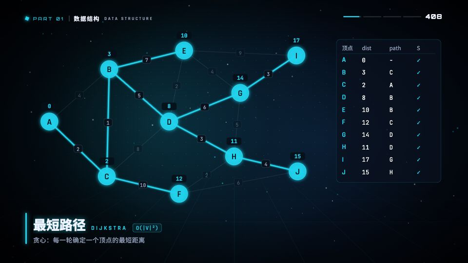
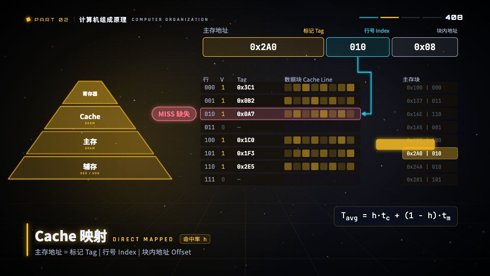
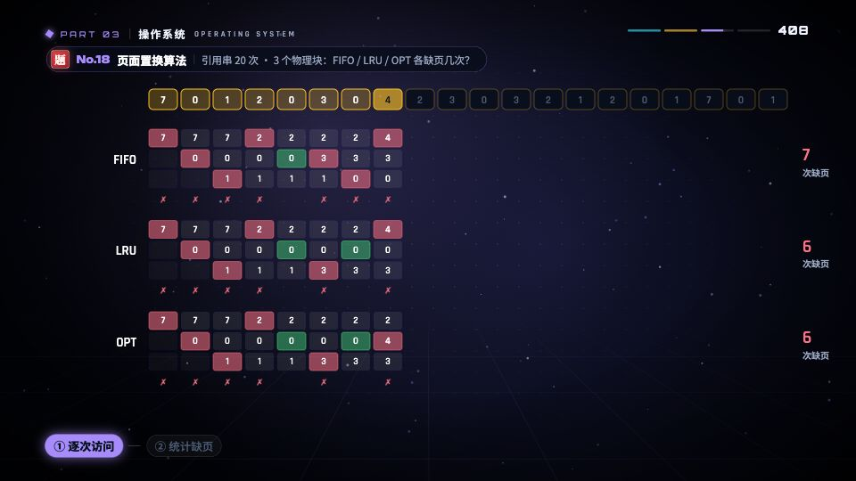
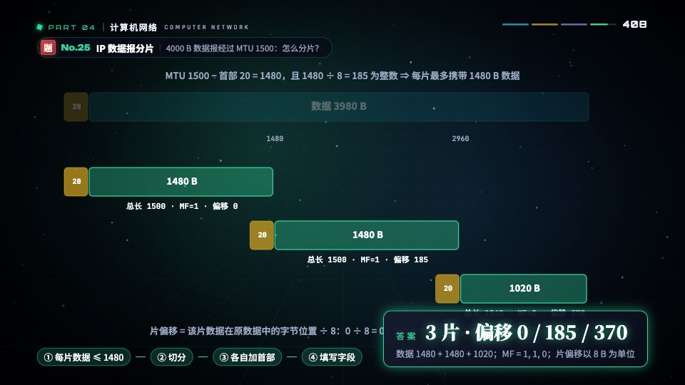

# 408 MV

408 计算机考研四门课（数据结构 / 组成原理 / 操作系统 / 计网）的 Remotion 动画 MV 工程。
1920×1080 / 60fps，时间轴驱动，一套代码同时出「渲染成片」和「网页实时版」。

## 效果预览

| 开场 | 数据结构 · Dijkstra | 组成原理 · Cache 映射 |
|---|---|---|
|  |  |  |

| 操作系统 · 页面置换 | 计网 · 数据报分片 | 结尾 · 四科星系 |
|---|---|---|
|  |  |  |

## 内容结构

- `intro`：开场 + 星系 люд
- `ds`：数据结构（线性表、栈队、KMP、树、AVL、哈夫曼、图、Dijkstra/Kruskal、AOE、哈希、B 树、排序、堆、归并……）
- `co`：组成原理（冯诺依曼、溢出、IEEE754、加法器、Cache、矩阵、虚拟存储、数据通路、流水线冒险、IO……）
- `os`：操作系统（系统调用、进程、调度、PV/读写者、死锁/银行家、页面置换、inode、磁盘……）
- `cn`：计算机网络（协议栈、香农、CSMA、窗口、子网、IP 分片、TCP、拥塞控制、Web……）
- `fin`：蒙太奇 + 星系收尾 + Logo

时间轴定义在 `src/timeline.ts`（`ACT_DEFS` / `SHOTS` / `TOTAL`），场景在 `src/scenes/`，转场与镜头在 `src/components/Shot.tsx`。

## 快速开始

```bash
npm install
npm run studio        # Remotion Studio 预览，选 MV408
npm run web:dev       # 网页实时版（Remotion Player），浏览器打开看效果
```

## 渲染成片

```bash
npm run render        # remotion render MV408 out/408_MV.mp4
```

渲染配置在 `remotion.config.ts`（h264 / crf 17 / yuv420p / jpeg 92，并发 8）。
`out/`、`*.log` 不进仓库（见 `.gitignore`），成片自己本地留。

## 网页版部署

```bash
npm run web:build     # 产物到 dist/，放到 gh-pages 分支的 408/ 目录（线上 https://bili.bemly.moe/408/）
```

- 网页入口 `index.html` + `web/`（Player 实时渲染，带章节跳转，可静音/有声切换）
- 线上字体在 `web-public/fonts/`；`CNAME`（bili.bemly.moe）在 gh-pages 根目录，不随本项目构建
- 背景音乐用的是压缩版 `public/music2.mp3`（18M，随仓库）；母带 `music.wav` 43M / `music2.wav` 326M 只放本地，被 ignore

## 音频

- `audio/make_music.py` / `make_music2.py`：配乐生成脚本（`timeline.json` + `*_rms.npy` 是电平数据，均可再生）
- 本地渲染需要 `public/music2.wav`（母带不进仓库）；`npm run audio:mp3` 可从 wav 转出 mp3
- 网页版默认播 `web-public/music2.mp3` 流播，可边下边播

## 目录说明

```
src/            Remotion 主工程（Root/Main/timeline/scenes/components/theme）
web/            网页实时版（Player + 章节 UI）
web-public/     网页静态资源（fonts / music2.mp3）
public/         渲染用静态资源（music2.mp3 随仓库，*.wav 本地自备）
audio/          配乐脚本与电平数据
scripts/        辅助脚本（timeline 导出 / 地球仪 / 分镜表 / 静帧）
versions/v1/    历史版本小文件（mp4/wav 大文件不进仓库）
out/            本地渲染输出（不进仓库）
dist/           网页构建产物（不进 main，只上 gh-pages）
```

## 注意

- 大文件都不进仓库：`out/`、`public/*.wav`、`versions/**/*.mp4|wav|mov`、`dist/`（详见 `.gitignore`）
- `public/fonts/`（最大 24M）随仓库，渲染和网页都用它，别删
- 换电脑后先把 `public/music2.wav` 放回去再 `npm run render`，否则无声
